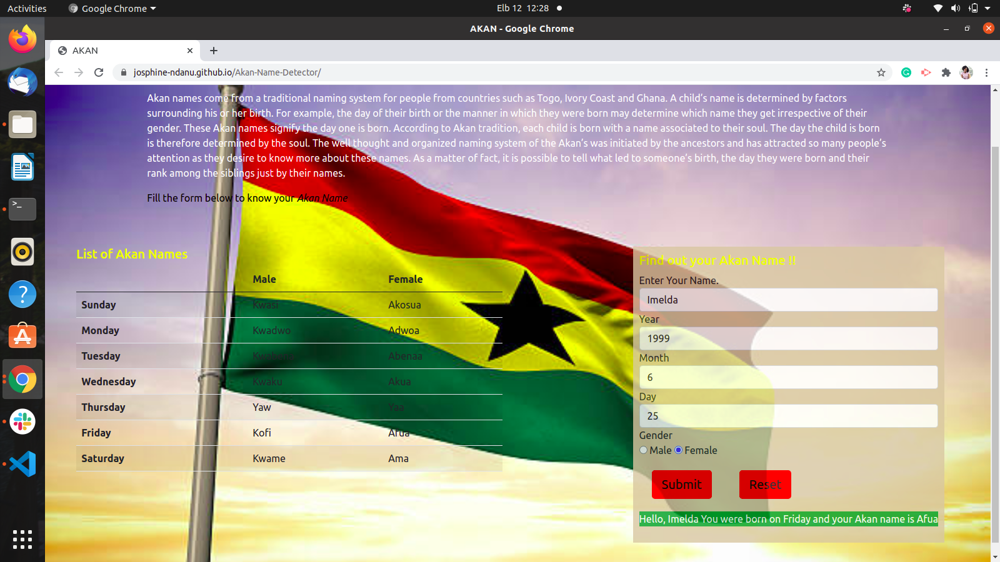

#Akan name generator

Here's a working demo

## Author
Josphine Ndanu, josphinendanu3@gmail.com

## Description
This project helps identify the day you were born then also ouputs your Ghananian Akan name based on the input you give.

### Prerequisites
You should have git installed.
Use the following command for installation.
`$ sudo apt install git-all`

### Setup
To access this project on your local files, you can clone it using these steps

Open your terminal
lone using this command `$ git clone https://github.com/josphine-Ndanu/Akan-Name-Detector
This will clone the repository into your local folder

## Behaviour Driven Development
| Behavior            | Input                         | Output                        | 
| ------------------- | ----------------------------- | ----------------------------- | 
| Day > 31            | 32 or more                    | Ivalid date                   |
| Month > 12          | 13 or more                    | Ivalid month                  |
| Gender is male      | Male                          | Male Akan names               |            
| Gender is female    | Female                        | Female Akan names             |

### Technologies Used
 HTML
 CSS
 js
 bootsrap 5
 Git

### Live Site
View [live](https://josphine-ndanu.github.io/Akan-Name-Detector/)

### Licence
This project is under the  [MIT](LICENSE) licence

